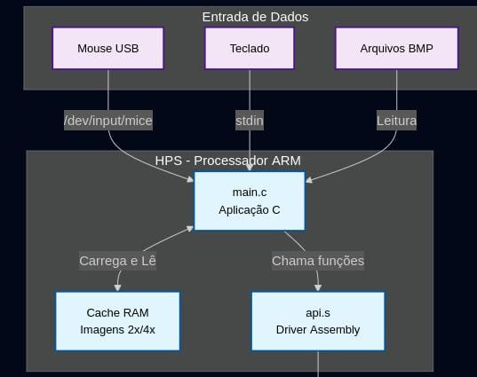
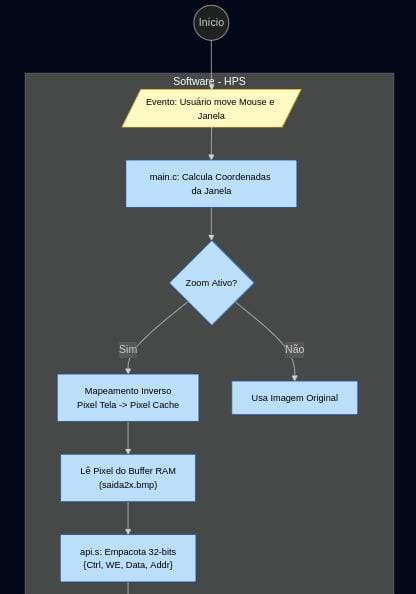
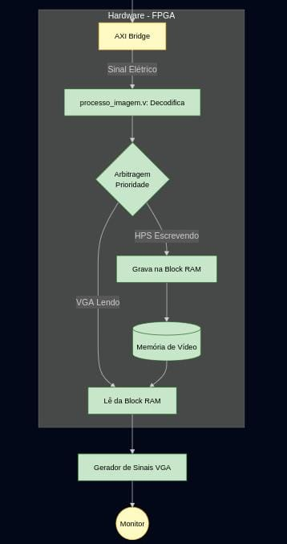
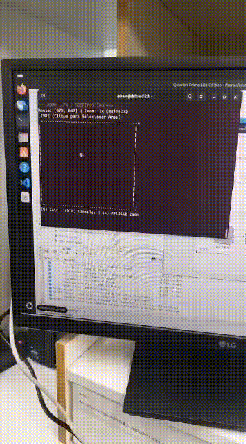

<h3 align="center">Utilização de Coprocessador Gráfico para Redimensionamento de Imagens na Plataforma DE1-SoC</h3>

  Este projeto implementa um módulo embarcado para sistemas de vigilância e exibição em tempo real. A solução integra um coprocessador gráfico desenvolvido na FPGA da placa DE1-SoC, drivers de dispositivo Linux e uma aplicação em C para manipulação de imagens (Zoom In/Out) controlada via mouse.

[Sobre o projeto](#sobre-o-projeto) 
• [Requisitos](#requisitos) 
• [Instalação](#instalação) 
• [Solução](#solução)
• [Arquitetura](#arquitetura) 
• [ Estrutura e ferramentas](#estruturas-e-ferramentas-utilizadas) 
•  [Fluxo de Dados](#fluxo-de-dados) 
• [Testes e Resultados](#testes-e-resultados) 

## 📄Sobre o Projeto

O presente projeto insere-se no âmbito do desenvolvimento da aplicação principal em linguagem C para o Hard Processor System (HPS) da plataforma DE1-SoC, que corresponde à terceira e crucial etapa do trabalho. Esta aplicação será a interface de usuário definitiva, responsável por carregar a imagem de um arquivo BITMAP, gerenciar a transferência de dados para a FPGA e acionar as operações de zoom.

A inovação desta fase reside na implementação de um controle de redimensionamento dinâmico via mouse. A aplicação C deverá permitir que o usuário utilize o mouse para definir uma região de interesse (janela) sobre a imagem original. A janela ampliada (zoom in), que deverá ser desenhada sobre a imagem original, poderá ter seu nível de ampliação controlado pelas teclas '+' (mais) e '-' (menos), proporcionando uma experiência de usuário mais interativa e precisa. O sucesso desta etapa valida a integração de periféricos complexos (como o mouse) com o módulo de processamento de imagem em tempo real, demonstrando a capacidade da solução embarcada para aplicações avançadas de visualização.

## 🧾Requisitos 
* *Carregamento de Imagem:* Leitura de arquivos .bmp (8-bits escala de cinza) e transferência para o coprocessador.
* *Interface de Texto:* Exibição das coordenadas (x, y) do mouse em tempo real no terminal.
* *Seleção de Região (Janela):*
    * Uso do mouse para definir dois cantos opostos da janela de ampliação.
    * Seleção confirmada ao pressionar o botão do mouse.
    * A janela selecionada é desenhada sobre a imagem original.
* *Controle de Zoom:*
    * *Tecla +:* Aplica Zoom In na janela selecionada.
    * *Tecla -:* Aplica Zoom Out (limitado à resolução original da imagem).

A solução é dividida em camadas de abstração:
1.  *Hardware (FPGA):* Coprocessador gráfico dedicado (CoLenda) e saída VGA.
2.  *Kernel Space (Linux):* Drivers desenvolvidos para gerenciar a comunicação HPS-FPGA, mouse USB e periféricos.
3.  *User Space (Aplicação C):* Software responsável por ler arquivos BMP, capturar eventos de mouse e enviar comandos de renderização.

### Etapas Desenvolvidas

* *Etapa 2 (API Assembly):* Desenvolvimento de uma biblioteca de funções (API) em Assembly para acesso aos registradores da FPGA e controle do coprocessador.
* *Etapa 3 (Aplicação Final):* Aplicação interativa que carrega imagens e permite seleção de região de interesse para zoom.

---

## 📦Instalação

<h3>Pré-requisitos</h3>

* Placa de desenvolvimento DE1-SoC com Linux embarcado.
* Conexão via SSH .
* Compilador gcc e utilitário make.
* Arquivo de imagem .bmp (8-bits, resolução compatível).
* Mouse USB conectado à placa.

#### 1. Clonar o repositório
bash
git clone [https://github.com/mclara9593/coprocessadorAPI.git](https://github.com/mclara9593/coprocessadorAPI.git)

#### 2. Compilar o projeto Quartus dentro da pasta "fase2judoreaclara"

#### 3. Lançar projeto para a placa DE1-Soc.

 + Acessar a ferramenta ``programmer`` e clicar em start.

#### 4. Construir o código da terceira etapa. 

 bash
    $ cd cooprocessadorAPI
	$ make

#### 5. Executar interface de usuário.
 bash
   $ sudo ./projeto

## 💻Solução

A solução geral integra três componentes principais — *HPS (C + Linux), **API em Assembly* e *FPGA (Verilog)* — que trabalham em conjunto para permitir que o usuário selecione uma área específica da imagem por meio do *mouse, enviando dois pontos delimitadores que definem uma janela de zoom. A partir desses dados, o coprocessador passa a ler e processar apenas os pixels dentro dessa região, aplicando zoom in ou zoom out conforme solicitado. Para que isso fosse possível, foi necessário modificar a arquitetura inicial do coprocessador, que antes operava com entrada sequencial fixa e agora precisa lidar com **intervalos variáveis de leitura* definidos em tempo real.

## 👩🏻‍💻Arquitetura 

A solução utiliza a arquitetura híbrida da DE1-SoC. O *HPS (ARM Cortex-A9)* executa o Linux e a lógica da aplicação, enquanto a *FPGA* realiza a aceleração gráfica.

  <figure>  
    
    <figcaption>
      
<strong>Figura 1</strong> - Arquitetura 

    </figcaption>
  </figure>

### Componentes Principais
1.  *Aplicação C:* Realiza o parsing do BMP, calcula a interpolação dos pixels para o zoom e gerencia a seleção de algoritmos e fatores de zoom.
2.  *Drivers :*
    * Driver GPU: Gerencia a fila de instruções para garantir que a escrita na FPGA respeite o tempo de sincronismo de vídeo (V-Sync).
    * Driver Mouse: Captura eventos brutos do USB e converte para coordenadas de tela (640x480).
3.  *FPGA:* Processa instruções de desenho de polígonos e renderização de pixels na memória de vídeo, além de seguir executando o processamento de pixels via algoritmos pré-programados nas etapas anteriores.
4.   *HPS:* Envio de instruções,chamadas de sistema,comunicação com dispositivos de I/O

## FPGA

> **Imagem Original** (HPS)  -->  **ROM** -->  **Coprocessador** (Zoom)  -->  **RAM** (Prioridade)  -->  **Monitor VGA** (ou volta para o HPS).

#### **Controladora (`processo_imagem.v`)**
É o "topo" da hierarquia e gerencia todos os recursos compartilhados.
* **Gerenciador de Memória:** Instancia a memória de entrada (`rom_inst_OR`) e a memória de saída (`ram_inst`).
* **Arbitro de Barramento:** Decide quem pode acessar a memória RAM num dado momento (O Coprocessador escrevendo? O HPS lendo? O VGA exibindo?).
* **Gerador de Clock:** Usa um PLL (`pll100_inst`) para gerar clocks rápidos (100MHz) para as memórias e divide o clock para o VGA (25MHz).
* **Driver VGA:** Instancia o módulo `vga_inst` para gerar os sinais de sincronismo (`hsync`, `vsync`) e cores para o monitor.

#### **O Núcleo de Cálculo (`coprocessador.v`)**
É o motor de processamento. Ele não sabe nada sobre VGA ou HPS, apenas recebe pixels e devolve pixels processados.
* **Roteador de Algoritmos:** Instancia 4 módulos de processamento em paralelo:
    1.  `replicacao_pixel`
    2.  `media_de_blocos`
    3.  `vizinho_proximo_in`
    4.  `vizinho_proximo_out`.
* **Multiplexador de Saída:** Seleciona qual resultado desses 4 módulos será entregue ao controlador, baseando-se nas chaves `SW`.

### Fluxo de Controle 

O fluxo de dados segue um "pipeline" com 3 estágios críticos, controlados pela lógica do arquivo `processo_imagem.v`.

#### **Estágio 1: Entrada de Dados (HPS -> FPGA)**
O HPS envia a imagem original para a FPGA.
* **Mux de Endereço de Entrada:** Na linha 218 de `processo_imagem.v`, existe uma decisão:
    * Se o sinal `we` (Write Enable do HPS) for **1**, o endereço da memória vem do HPS (`addr_in`).
    * Se `we` for **0**, o endereço vem da contagem interna da FPGA (para leitura).
* **Resultado:** A imagem original é gravada na `rom_inst_OR`.

#### **Estágio 2: Processamento (ROM -> Coprocessador -> RAM)**
Quando o HPS ativa uma chave de algoritmo (ex: `SW[0]=1`):
1.  **Leitura:** O contador `rom_addr_counter` começa a incrementar, lendo pixels da `rom_inst_OR`.
2.  **Cálculo:** O pixel entra no `coprocessador.v`, passa pelo algoritmo selecionado (ex: Zoom 2x) e sai pelo fio `pixel_coproc_out` junto com um sinal de validade `pixel_coproc_valid`.
3.  **Escrita:** O resultado é gravado na `ram_inst` (Memória de Saída).

#### **Estágio 3: Arbitragem de Saída (RAM -> VGA ou HPS)**
Este é o ponto mais complexo do fluxo, localizado nas linhas 230-233 de `processo_imagem.v`. Como a memória RAM só tem uma porta de endereço, o código implementa um **Sistema de Prioridade Estrita**:

1.  **Prioridade Alta (Escrita do Coprocessador):**
    * Se o coprocessador tiver um pixel pronto (`pixel_coproc_valid`), ele ganha o controle da RAM imediatamente para gravar o dado.
    * *Endereço:* `pixel_write_count`.

2.  **Prioridade Média (Leitura do HPS):**
    * Se o coprocessador terminou (`process_done_latch`) **E** o HPS ativou o modo leitura (`SW[4]=1`), o HPS ganha o controle para ler a imagem processada (usado na sua função de salvar BMP).
    * *Endereço:* `{data_in[3:0], addr_in}` (HPS constrói o endereço de 19 bits).

3.  **Prioridade Baixa (VGA Display):**
    * Se ninguém mais precisa da RAM, o VGA tem acesso livre para ler e exibir a imagem no monitor.
    * *Endereço:* `ram_addr_vga_calc` (Calculado com base na varredura X, Y da tela).

## HPS

> Enquanto a FPGA faz o processamento massivo e paralelo (calcular a cor de milhares de pixels), o HPS atua como:
1.  **Tradutor:** Converte arquivos BMP em sinais elétricos.
2.  **Gerente:** Decide qual algoritmo a FPGA vai rodar agora.
3.  **Interface:** Traduz movimentos do mouse em comandos de desenho.

###  A Camada de Sistema 

* **Mapeamento de Memória (`init_memory` em `api.s`):**
    O processador executa chamadas de sistema (`open` e `mmap`) para conectar um endereço de memória virtual do software diretamente ao endereço físico da ponte **Lightweight HPS-to-FPGA** (`0xFF200000`).
    * *O que acontece:* Isso cria um "túnel" onde qualquer coisa que o software escreva nessa variável especial é enviada fisicamente para os pinos da FPGA.

### A Camada de Driver (Assembly `api.s`)

* **Empacotamento de Comandos (`escrever_pixel_end`):**
    A FPGA espera receber tudo de uma vez: Endereço, Cor e Controle. O processador usa instruções de deslocamento (`lsl`) e lógica (`orr`) para montar um pacote de 32 bits:
    * **Bits 0-14:** Endereço do pixel (0 a 32.767).
    * **Bits 15-22:** Valor da cor do pixel (0 a 255).
    * **Bit 23:** Sinal de *Write Enable* (Gatilho para gravar).
    * **Bits 24-31:** Sinais de Controle (Algoritmos/Switches).

* **Protocolo de Leitura "Write-Wait-Read" (`ler_pixel_fpga`):**
    Como a FPGA é mais lenta que o processador ARM (que roda a quase 1GHz), o HPS precisa gerenciar o tempo:
    1.  **Solicita:** Escreve o endereço que quer ler no barramento.
    2.  **Espera:** Executa um loop "vazio" (`delay_addr`) para dar tempo ao sinal elétrico viajar até a FPGA e a memória RAM responder.
    3.  **Lê:** Só então lê o registrador de entrada (`PIO_INPUT_OFFSET`).

### A Camada de Aplicação (`main.c`)

* **Máquina de Estados do Mouse:**
    O processador lê continuamente o arquivo `/dev/input/mice`. Ele interpreta os bytes brutos do protocolo PS/2 (movimento X, Y e cliques) e mantém o estado da interface (se o usuário está arrastando, selecionando ou dando zoom).

* **Gerenciamento de Cache Híbrido (`gerar_cache_zooms`):**
    Esta é a função mais inteligente do HPS. Em vez de calcular o zoom via software (lento) ou pedir à FPGA em tempo real para cada movimento do mouse (complexo), o HPS usa uma estratégia de **Cache**:
    1.  O HPS configura a FPGA para modo "Zoom 2x" (`set_zoom_2x`).
    2.  Envia a imagem inteira para a FPGA processar.
    3.  Lê o resultado processado de volta e salva num arquivo temporário (`saida.bmp`).
    4.  Repete o processo para o Zoom 4x.
    * *Resultado:* Quando o usuário usa a lupa, o HPS apenas recorta pedaços dessas imagens já prontas, garantindo uma resposta instantânea na tela.

* **Cálculo de Janela (`aplicar_overlay_bmp`):**
    Quando você move a janela de zoom, o HPS calcula quais pixels da imagem original devem ser substituídos pelos pixels da imagem de zoom (lida do cache). Ele faz a matemática de coordenadas e envia para a FPGA apenas os pixels dessa região específica, criando o efeito de sobreposição.

## 🛠Estruturas e ferramentas utilizadas

<b>Visão geral da DE1-SoC</b>

### Visão geral da DE1-SoC

Equipado com processador, USB, memória DDR3, Ethernet e uma gama de periféricos, o kit de desenvolvimento DE1-SoC (Figura 1) integra no 
mesmo Cyclone® V da Intel®, sistema em chip (SoC), um hard processor system (HPS) a uma FPGA (Field Programmable Gate Arrays). Este 
design permite uma grande flexibilidade da placa nas mais variadas aplicações. Para o acesso ao sistema operacional Linux embarcado na 
placa, o protocolo de rede SSH (Secure Shell) foi utilizado, estabelecendo uma conexão criptografada para comunicação entre a placa e 
computador host.

 [Kit de Desenvolvimento DE1-SoC](https://fpgacademy.org/index.html)

<b>Sistema computacional DE1-SoC</b>

### Sistema computacional DE1-SoC

#### HPS 
* Memory mapping
* Empacotamento de dados
* Handshake manual
* Sincronização

#### FPGA 
* FSM de algoritmos
* Flags de controle
* interface com VGA

 <b>Linguagem C</b> 

### Linguagem C

É uma linguagem de programação de propósito geral que combina abstrações e controles de baixo nível sobre o hardware resultando em ganho 
de eficiência. O software criado em 1970 por 
Dennis Ritchie é estreitamente associada ao sistema operacional UNIX, uma vez que as versões desse sistema foram escritas em linguagem 
C. Além disso, a sintaxe simples e a alta 
portabilidade desta linguagem entre dispositivos contribui para seu amplo uso em sistemas embarcados de recursos limitados.

 <b>Compilador GNU</b> 

### Compilador GNU

O GNU Compiler Collection GCC (Coleção de Compiladores GNU), ou GCC, é um conjunto de compiladores de código aberto desenvolvido pelo 
Projeto GNU que oferecem suporte a uma gama de 
linguagens de programação, incluindo C, C++, Fortran, Ada e Go. Esta ferramenta otimiza a compilação, ou seja a produção de código de 
máquina, nas várias linguagens e arquiteturas de 
processadores suportadas.

 <b>Nano</b> 

### Nano
Também, o editor de texto simples Nano, na versão 2.2.6, presente no Linux embarcado do Kit de desenvolvimento DE1-SoC foi utilizado 
para codificação da solução. O Nano é um software leve e que oferece uma interface de linha de comando intuitiva, tornando-o ideal para 
rápida edição de arquivos, scripts e outros documentos de texto.

## 🖧 Fluxo de dados

| Sinal         | Descrição | I/O | 
| ------------- | ------------- |------------- |
| we            |flag de status | I| 
| addr_in       |endereço de pixel| I| 
| data_in       | informações de carga| I| 
| SW            | modo de leitura | I| 
| to_hps_pio    | pixel lido da RAM| O| 

+ Obs: Esta tabela desconsidera a dispositivos I/O 

### Geração de "Cache"
Em `gerar_cache_zooms` :

1.  **HPS -> FPGA:** A função `gerar_cache_zooms` (em `main.c`) envia a imagem original para a FPGA.
2.  **Processamento:** A FPGA processa a imagem usando a replicação de pixels para gerar versões 2x e 4x.
3.  **FPGA -> HPS:** O HPS lê o resultado de volta via ponte *Lightweight* e salva esses dados na memória RAM (e disco como `saida.bmp`, `saida2x.bmp`).

### Entrada do Usuário
Em (`modo_mouse_interativo`):

1.  **Mouse -> Linux:** O movimento físico gera sinais USB que o Linux converte em bytes.
2.  **Aplicação:** O `main.c` 
    1.  Lê esses bytes brutos.
    2.  **Cálculo de Janela:** A FSM (Máquina de Estados) converte o movimento relativo ($dx, dy$) em coordenadas absolutas na tela ($0-159, 0-119$).
    3.  **Definição da Região:** Quando o usuário clica e arrasta, o software calcula matematicamente o retângulo ($X_{start}, 
      Y_{start}, Largura, Altura$) que define a "janela de interesse".

### Overlay
1.  **Seleção de cache:** A função `aplicar_overlay_bmp` seleciona o buffer de cache correto na RAM (ex: se for Zoom 2x, pega o buffer da imagem de 320x240).
2.  **Mapeamento Inverso:** Para cada pixel dentro da janela definida na tela, o software calcula qual pixel correspondente pegar no buffer de cache.
    * *Lógica:* "Se estou no pixel 10 da janela, pego o pixel 5 da imagem cache (porque o zoom é 2x)".
3.  **Recorte:** O valor do pixel (escala de cinza) é extraído.

### A Ponte HPS-FPGA
Envio de pixel **recortado** para a tela através de `escrever_pixel_end`: 

1.  **Empacotamento:**  O arquivo `api.s` pega o **Dado** (8 bits) e o **Endereço** calculado ($Y \times 160 + X$) e empacota tudo em uma palavra de 32 bits junto com o bit de **Write Enable**.
2.  **Escrita na Ponte:** A instrução Assembly `STR` escreve esse pacote no endereço virtual mapeado (Base `0xFF200000` + Offset `0x00`).
3.  **Barramento AXI:** O sinal viaja fisicamente do processador ARM para a FPGA através da *Lightweight Bridge*.

  <figure>  
    
    <figcaption>
      
<strong>Figura 2</strong> - Fluxo de dados: Mouse/BMP -> Aplicação -> Driver 

    </figcaption>
  </figure>

### FPGA e Exibição
O sinal chega no módulo `processo_imagem.v`.

1.  **Decodificação:** A FPGA recebe os 32 bits e separa: "Ah, o HPS quer escrever o valor 255 (Branco) na posição 1200".
2.  **Arbitragem (Multiplexador):** O hardware percebe que o HPS está escrevendo e dá prioridade a ele sobre o VGA.
3.  **Gravação na VRAM:** O pixel é gravado na Memória de Vídeo interna da FPGA, sobrescrevendo o que estava lá antes (background).
4.  **Renderização VGA:** O controlador VGA, que varre a memória 60 vezes por segundo, lê esse novo valor e o envia para o monitor.

  <figure>  
    
    <figcaption>
      
<strong>Figura 3</strong> - Fluxo de dados: Driver -> FPGA

    </figcaption>
  </figure>

## 🔎Testes e resultados

* **Validação da Comunicação:** Foram executados testes de escrita e leitura para assegurar a integridade dos dados trafegados entre o processador HPS e a memória interna da FPGA.
* **Estabilidade dos Controladores:** Não houve problemas técnicos referentes aos controladores de entrada e saída (drivers do mouse e PIO).
* **Estratégia de Renderização:** Após a avaliação de diferentes lógicas para o recorte da janela, a equipe optou pela implementação via *overlay*. Esta técnica utiliza duas imagens pré-carregadas no HPS (cache), garantindo fluidez na atualização da janela de zoom.

  <figure>  
    
    <figcaption>
      
<strong>Figura 4</strong> - Exibição  

    </figcaption>
  </figure>

## ✍️ Colaboradores

Este projeto foi desenvolvido por:

- [**Julia Santana**](https://github.com/)
- [**Maria Clara**](https://github.com/)
- [**Vitor Dórea**](https://github.com/)

Agradecimentos ao professor **Angelo Duarte** e aos tutores **Wesley** e **Alan**.